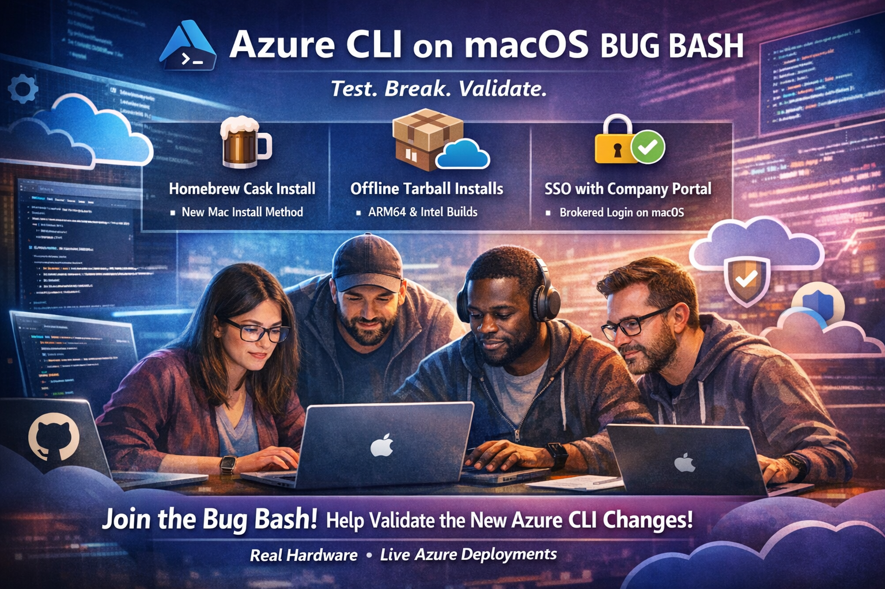

# bugbash-azcli

This repo contains Azure CLI macOS bug bash exercises, demos, and validation scripts — orchestrated through GitHub Copilot Chat.

## Azure CLI macOS Bug Bash

<p align="center">
  
</p>

The primary focus of this repo is the **Azure CLI on macOS — Installation & Authentication Bug Bash**. It validates three major changes shipping together:

1. **Homebrew Cask installation** — Azure CLI moves from the legacy formula to a self-contained, pre-built Cask bundle
2. **Offline tarball installs** — architecture-specific (ARM64/Intel) distributions for air-gapped environments
3. **Broker-based authentication** — Company Portal SSO on macOS, matching the Windows experience

See [README_BugBash.md](README_BugBash.md) for the full overview — what's changing, why it matters, and how the 6 phases are structured.

## Exercises

This repo contains several exercises. Each has its own folder with a README covering prerequisites, setup, and usage. Start with the one that matches your goal:

| Exercise | Description | Details |
| ----------|-------------|---------|
| **Azure CLI — Install & Broker Test** _(Bug Bash)_ | 39 steps across 6 phases: existing state, cask install, offline tarball, broker auth, Ring Zero, telemetry | [azcli_install_and_broker_test/](azcli_install_and_broker_test/) |
| **Unix Commands (Demo Simulation)** | 8 guided steps across 2 phases with all execution modes: auto, interactive, manual, destructive | [bugbash_demo/](bugbash_demo/) |
| **Azure CLI — Ring Zero (Individual)** | 8 Azure CLI scripts testing foundational Azure services individually (Create → Verify → Delete per service) | [azcli_ringzero_test/](azcli_ringzero_test/) |
| **Azure CLI — Ring Zero (Integrated)** | All 8 services deployed together as an interconnected architecture in a single RG, with user-confirmed cleanup | [azcli_ringzero_integrated/](azcli_ringzero_integrated/) |

## Getting Started

1. **Clone and open in VS Code**

   ```unix
   git clone https://github.com/naga-nandyala/bugbash-azcli.git
   cd bugbash-azcli
   code .
   ```

2. **Set up your environment**

   ```unix
   cp .env.template .env
   ```

   Edit `.env` and fill in your values.

3. **Pick an exercise** from the table above and follow its README.

## Structure

```markdown
├── README.md                            # This file
├── README_BugBash.md                    # Bug bash overview (what & why)
├── .github/prompts/
│   ├── bugbash_demo.prompt.md           # Copilot prompt — Unix demo
│   └── bugbash.prompt.md               # Copilot prompt — Install & Broker
├── azcli_install_and_broker_test/       # Bug bash exercise (6 phases, 39 steps)
│   ├── README.md
│   └── phase1-steps.md … phase6-steps.md
├── azcli_ringzero_test/                 # Individual Ring Zero service tests
│   ├── README.md
│   ├── main.sh
│   └── 1_entra_id.sh … 8_monitor.sh
├── azcli_ringzero_integrated/           # Integrated Ring Zero architecture test
│   ├── README.md
│   └── integrated_test.sh
├── bugbash_demo/                        # Unix demo simulation
│   ├── README.md
│   └── phase1-steps.md, phase2-steps.md
└── resources/                           # Images and diagrams
```
