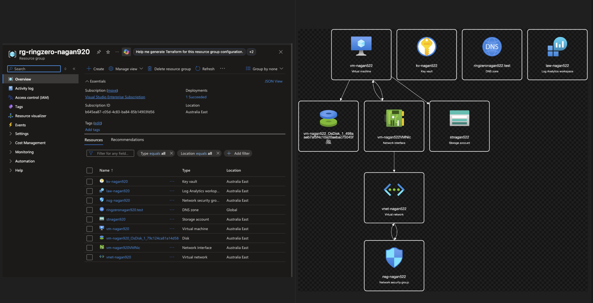

# Azure Ring Zero — Service Validation Suite

Validate Azure's foundational Ring Zero services using the Azure CLI. Designed as a **capstone exercise** for bug bash participants running against their own VS Enterprise Azure subscriptions.

## What are Ring Zero Services?

Ring Zero services are the foundational infrastructure that Azure itself depends on. If any of them go down, virtually every other Azure service is affected.

| # | Service | What it provides |
|---|---------|-----------------|
| 1 | **Entra ID** (Azure AD) | Identity and authentication for all Azure services |
| 2 | **Azure Resource Manager** (ARM) | Control plane for provisioning and managing resources |
| 3 | **Azure DNS** | Name resolution underpinning Azure's networking |
| 4 | **Azure Networking** | Virtual networks, subnets, network security groups |
| 5 | **Azure Storage** | Object/blob storage used internally by many services |
| 6 | **Azure Compute** | Hypervisor and fabric controller for VMs |
| 7 | **Azure Key Vault** | Secrets and certificate management |
| 8 | **Azure Monitor** | Telemetry, metrics, and log analytics pipeline |

## Integrated Architecture Test

Deploy **all Ring Zero services into a single resource group** as an interconnected mini-architecture. Designed as a **visual capstone** — you create everything, inspect it in the portal, then confirm before cleanup.

## What Does It Build?

Instead of testing each service in isolation (create → verify → delete), this script deploys all eight Ring Zero services **wired together** so you can see them as a cohesive architecture.



### Service Interconnections

| From | To | Connection |
|------|----|------------|
| **NSG** | Subnet | NSG attached to subnet |
| **VM** | Subnet / VNet | NIC placed in subnet (no public IP) |
| **VM** | Storage Account | Boot diagnostics writes to storage |
| **Key Vault** | Storage Account | Stores storage account key as a secret |
| **Key Vault** | Log Analytics | Diagnostic settings → AuditEvent logs |
| **Storage Account** | Log Analytics | Diagnostic settings → Transaction metrics |
| **DNS Zone** | VM | A record → VM private IP |
| **DNS Zone** | Storage | CNAME → storage blob endpoint |
| **Service Principal** | Resource Group | Reader RBAC role assignment |

## Prerequisites

- [Azure CLI](https://aka.ms/installazurecli) installed
- Logged in: `az login`
- An active Azure subscription (VS Enterprise recommended)
- Sufficient permissions to create resources, service principals, and role assignments

## Quick Start

```bash
cd azcli_ringzero_integrated/
./integrated_test.sh
```

The script will:

1. Show your current subscription and list all services it will create
2. Ask for confirmation before deploying
3. Deploy all services in dependency order
4. Print a resource inventory and interconnection details
5. Provide a portal link so you can **inspect everything live**
6. Ask for **explicit confirmation** before deleting the resource group

## How It Works

### Three-Phase Flow

| Phase | What happens |
|-------|-------------|
| **Phase 1 — Create** | Deploys all 9 services in dependency order into a single resource group |
| **Phase 2 — Verify & Show** | Lists all resources, shows interconnections, prints a deployment summary table |
| **Phase 3 — Cleanup** | Pauses with a portal link for inspection, then asks `Delete resource group '...' and ALL its contents? (yes/no):` before destroying anything |

### Key Differences from the Individual Test Suite

| Individual suite (`azcli_ringzero_test/`) | Integrated test (`azcli_ringzero_integrated/`) |
|---|---|
| Tests each service in isolation | Deploys all services together |
| Create → Verify → Delete per service | Create all → Inspect → Delete all at once |
| Automatic cleanup | User-confirmed cleanup |
| Services are independent | Services are wired together |
| Tests individual CLI commands | Tests a realistic architecture |

## Script

```
azcli_ringzero_integrated/
└── integrated_test.sh   # All-in-one: deploy, verify, inspect, cleanup
```

> **Note:** The script reuses `azcli_ringzero_test/lib/common.sh` for shared config, colors, logging, and lifecycle helpers.

## Cost

The `Standard_B1s` VM and `Standard_LRS` storage account incur minor costs while running. Delete the resource group promptly after inspection to minimise charges.

## Cleanup

If you skip cleanup when prompted, you can tear down later:

```bash
# Delete the resource group (cascades to all Azure resources inside it)
az group delete --name rg-ringzero-XXXXX --yes

# Delete the service principal
az ad sp list --display-name "sp-ringzero" -o table
az ad sp delete --id <APP_ID>

# Purge soft-deleted Key Vault to release the name
az keyvault purge --name kv-XXXXX
```
