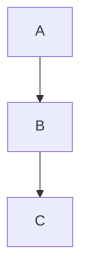
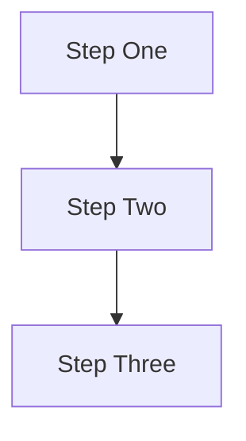
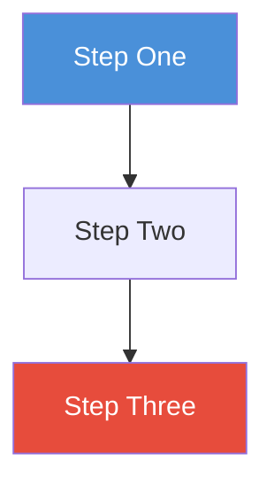
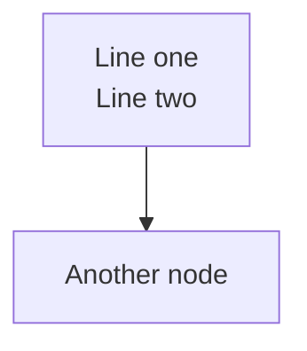
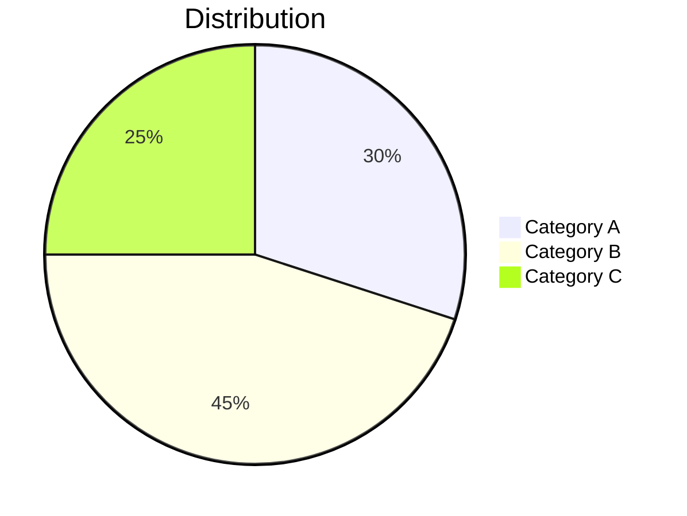

# Mermaid Test

## Test 1 - Simplest possible

```mermaid
graph TD
    A --> B
    B --> C
```

## Test 2 - With labels

```mermaid
graph TD
    A["Step One"] --> B["Step Two"]
    B --> C["Step Three"]
```

## Test 3 - With colors

```mermaid
graph TD
    A["Step One"] --> B["Step Two"]
    B --> C["Step Three"]
    style A fill:#4A90D9,color:#fff
    style C fill:#E74C3C,color:#fff
```

## Test 4 - With newlines in labels

```mermaid
graph TD
    A["Line one\nLine two"] --> B["Another node"]
```

## Test 5 - LR direction

```mermaid
graph LR
    A["Phase 1"] -->|link text| B["Phase 2"]
    B -->|more text| C["Phase 3"]
```

## Test 6 - Pie chart

```mermaid
pie title Distribution
    "Category A" : 6
    "Category B" : 9
    "Category C" : 5
```
